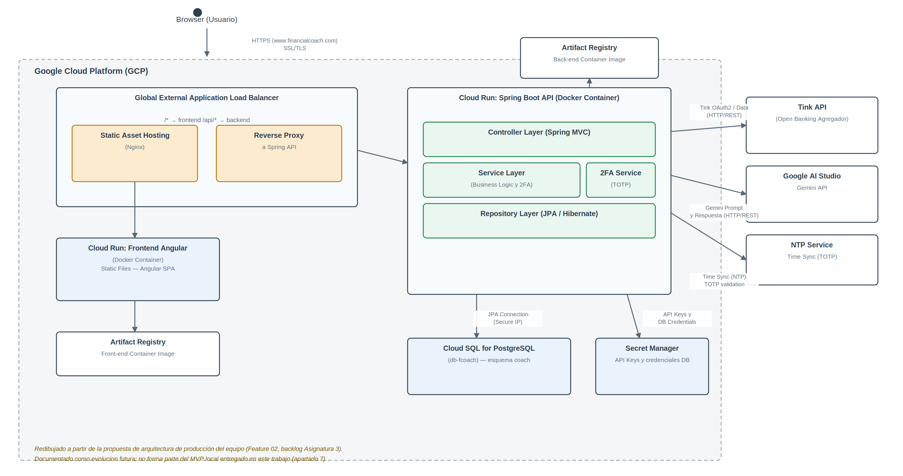

# Alineación con el backlog de Jira (Asignatura 3) y evolución futura

**Estado: documentación de referencia, no implementada.** Este fichero deja
constancia por escrito de cómo el MVP de persistencia documentado en este
repositorio se relaciona con la arquitectura de producción y el backlog ya
definidos en la Asignatura 3 (metodología ágil), para que ambas entregas del
TFM resulten coherentes entre sí aunque no exista un requisito explícito que
las obligue a estarlo.

## 1. Arquitectura de producción en Google Cloud Platform

*(Redibujado por el equipo a partir de la propuesta original, manteniendo la misma paleta visual que el resto de diagramas del trabajo. Ver también [`diagrama_roadmap_evolucion.png`](./diagrama_roadmap_evolucion.png) para una síntesis visual de todas las líneas de evolución del apartado 7.)*

Esta arquitectura (Cloud Run para frontend Angular y backend Spring Boot,
Cloud SQL para PostgreSQL, Secret Manager para credenciales, Artifact
Registry para las imágenes Docker) es la evolución de producción prevista
para el producto. **No sustituye ni condiciona el MVP local documentado en
este repositorio**: el MVP se ejecuta íntegramente con `docker compose up -d`
sin ninguna dependencia de GCP, exactamente como exige la guía de la
asignatura. La base de datos `Cloud SQL for PostgreSQL` de este diagrama es,
en esencia, el mismo esquema `coach` documentado aquí, desplegado sobre un
servicio gestionado en lugar de un contenedor local.

## 2. Correspondencia con la Feature 02 (Arquitectura de Solución e
Infraestructura Cloud) del backlog

| Task del backlog (Asignatura 3) | Relación con este trabajo |
|---|---|
| Task 1 — Benchmark de proveedores cloud, decisión por integración nativa con Gemini | Justifica por qué la arquitectura futura usa GCP; no afecta a la tecnología de persistencia elegida aquí (PostgreSQL), que es independiente del proveedor cloud |
| Task 2 — Análisis de costos operativos y unit economics | Fuera del alcance de este trabajo (SGBD); se apoya en el volumen de datos ya caracterizado en el apartado 2 del documento entregado |
| Task 3 — Diseño de infraestructura de seguridad (VPC, Firewalls, Secret Manager) | El MVP local usa credenciales en claro en `docker-compose.yml` por simplicidad de evaluación académica; en producción se sustituirían por Secret Manager, tal como prevé el backlog |

## 3. Correspondencia con la Feature 03 (Inteligencia de Datos y Motor de
Predicción) — aclaración importante sobre el rol de cada tecnología de IA

El backlog de la Asignatura 3 ya asigna roles **distintos y complementarios**
a dos tecnologías de IA, que conviene no confundir entre sí:

- **US-02 (NLP de categorización):** *"Como Sistema, quiero traducir las
  descripciones técnicas de los bancos a categorías humanas mediante
  Gemini"*. El rol previsto para Gemini es la clasificación de texto libre
  (descripciones de transacciones bancarias) en categorías cerradas, con un
  criterio de aceptación del 90% de acierto.
- **US-03 (modelado predictivo):** *"Como data scientist, quiero entrenar un
  modelo XGBoost con los datos históricos, para calcular el saldo estimado
  del usuario al cierre del periodo"*. El motor predictivo real —equivalente
  a los tres modelos de machine learning ya entrenados y documentados en el
  TFM (regresión lineal, regresión logística, serie temporal)— se concibió
  como un modelo entrenado sobre datos propios, no como una llamada a un
  modelo generativo externo.

Esta distinción es la razón por la que el MVP de SGBD **no sustituye los tres
modelos de ML por llamadas a la API de Gemini**: hacerlo no solo introduciría
una dependencia de un servicio externo (incompatible con el requisito de
evaluación 100% local de la guía de la asignatura), sino que además se
apartaría de lo que el propio equipo ya había planificado en la Asignatura 3.

## 4. Sobre la integración con Tink (agregador PSD2)

La Feature 01 del backlog (*Marco Normativo y Seguridad de Datos*) define la
integración con el agregador como una actividad regulada: contrato firmado,
SLA documentado, un flujo de consentimiento SCA con vigencia de 180 días bajo
PSD2, y una matriz de datos sensibles para cumplir RGPD/LOPDGDD (derechos
ARSULI). Confirma que la integración real con Tink es una actividad de
producción con peso legal propio, coherente con la decisión ya documentada en
[`tink_mapping.md`](./tink_mapping.md) de mantenerla como referencia de
mapeo de campos y no como dependencia del MVP académico.

## 5. Resumen de la relación entre ambas entregas

| Este trabajo (Asignatura 6 — SGBD) | Backlog (Asignatura 3) |
|---|---|
| MVP local, reproducible con un único comando, sin dependencias externas | Arquitectura de producción en GCP, con integraciones reales (Tink, Gemini) |
| Tres modelos de ML propios, documentados y ya entrenados | US-03: modelo XGBoost como visión de producción del mismo motor predictivo |
| Tink documentado solo como referencia de mapeo de campos | Feature 01: integración regulada con el agregador, con cumplimiento legal explícito |
| Dataset C implementado con JSONB sobre PostgreSQL (apartado 4.3) | Gemini reservado para NLP de categorización (US-02), no para el motor predictivo |

Ambas entregas son coherentes entre sí: el MVP de SGBD es la base técnica
sobre la que se apoyará la implementación descrita en el backlog, no una
versión alternativa o contradictoria de la misma.
