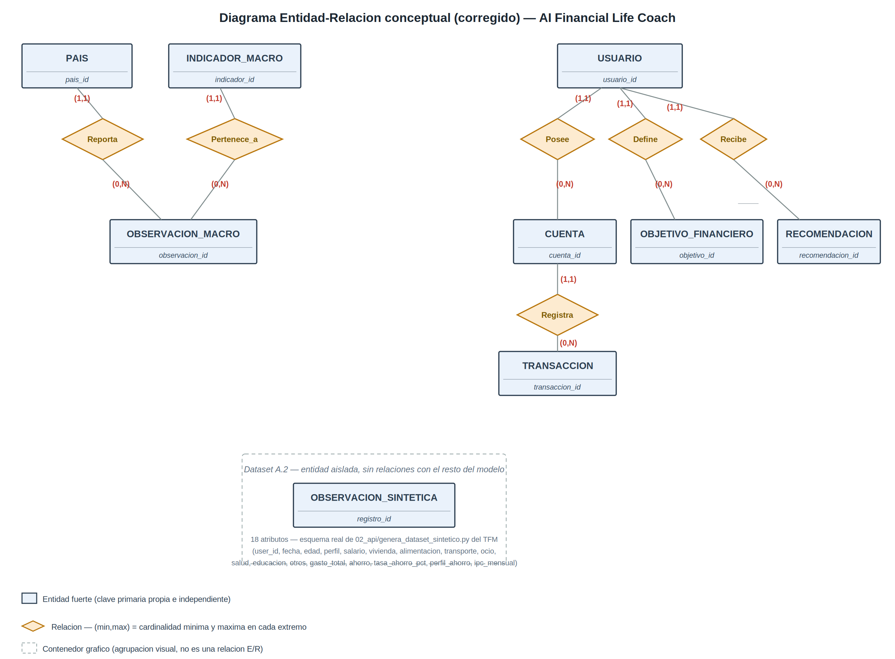

# Modelo de datos — AI Financial Life Coach (Grupo 05)

Este documento resume el modelo conceptual y físico implementado en este
repositorio, de forma autocontenida (sin necesidad de consultar el PDF
entregado para poder reproducir o auditar el esquema).

## 1. Diagrama Entidad-Relación (Datasets A y B — PostgreSQL)

## 2. Entidades y claves

Todas las entidades del modelo son **entidades fuertes**: cada una tiene una
clave primaria propia e independiente (identificador autoincremental). Cuatro
de ellas mantienen además una **dependencia existencial** hacia otra entidad
(participación total, cardinalidad (1,1)):

| Entidad | Clave primaria | Depende existencialmente de | Regla de borrado |
|---|---|---|---|
| `paises` | `pais_id` | — | — |
| `indicadores_macro` | `indicador_id` | — | — |
| `observaciones_macro` | `observacion_id` | `indicadores_macro`, `paises` | RESTRICT |
| `observaciones_sinteticas` | `registro_id` | — (entidad aislada, Dataset A.2) | — |
| `usuarios` | `usuario_id` | `paises` (opcional) | RESTRICT |
| `cuentas` | `cuenta_id` | `usuarios` | CASCADE |
| `transacciones` | `transaccion_id` | `cuentas` | RESTRICT |
| `objetivos_financieros` | `objetivo_id` | `usuarios` | CASCADE |
| `recomendaciones` | `recomendacion_id` | `usuarios` | CASCADE |

`observaciones_macro` resuelve además la única relación N:M del modelo
(`paises` ↔ `indicadores_macro`), incorporando los atributos propios de esa
relación (`periodo`, `valor`, `fuente`, `fecha_extraccion`) y una restricción
`UNIQUE (indicador_id, pais_id, periodo)` que evita duplicados temporales.

## 3. Reglas de integridad principales

- **CASCADE** se aplica cuando la entidad dependiente pierde todo su sentido
  sin la entidad propietaria (p. ej., las cuentas de un usuario eliminado).
- **RESTRICT** se aplica cuando existe un requisito de conservación de
  historial que prevalece sobre la simplicidad del borrado (p. ej., las
  transacciones no pueden desaparecer arrastradas por el borrado de una
  cuenta sin una decisión explícita, por su valor de auditoría).
- El dominio de `transacciones.categoria` consta de diez valores cerrados:
  los siete alineados con las categorías de gasto del dataset sintético
  (`vivienda`, `alimentacion`, `transporte`, `ocio`, `salud`, `educacion`,
  `otros`) más tres adicionales propios de un libro de movimientos real que
  no existen en el dataset sintético por no ser gasto (`ingresos`, `ahorro`,
  `transferencia`).
- `observaciones_sinteticas` reproduce mediante restricciones `CHECK` las
  verificaciones de coherencia interna ya validadas por el grupo en la
  asignatura de obtención de datos: `gasto_total` como suma de las siete
  categorías, `ahorro = salario - gasto_total`, `tasa_ahorro_pct =
  ahorro / salario * 100`, y consistencia de `perfil_ahorro` respecto a los
  umbrales documentados. Los dominios y rangos de columna (`perfil` en
  `{junior, medio, senior, freelance}`, `edad` entre 25 y 40 años, `salario`
  entre 1.134 € y 6.800 €, y los rangos del resto de columnas numéricas) se
  han verificado y alineado con la tabla de variables del trabajo de la
  Asignatura 5 "Obtención de Datos para el TFM", para evitar cualquier
  divergencia entre ambos entregables del grupo.

El detalle completo (tipos de datos, todas las restricciones, índices y la
vista `v_saldo_usuario`) está en [`../sql/ddl/001_schema.sql`](../sql/ddl/001_schema.sql).

## 4. Dataset C (MongoDB) — solo diseño, no implementado en este MVP

El Dataset C se modela mediante un esquema de documento (JSON anotado +
validación `$jsonSchema`), no mediante E/R, por la naturaleza variable de su
estructura según el modelo de machine learning que genera cada interacción.

Su implementación física queda deliberadamente fuera de este MVP (no hay
contenedor MongoDB en `docker-compose.yml`), a la espera de que exista una
interfaz conversacional real que lo alimente. El esquema de referencia
completo, con un documento de ejemplo por cada uno de los tres modelos de
ML del TFM, está documentado en
[`../mongo/schema_interacciones.design.js`](../mongo/schema_interacciones.design.js).

## 5. Justificación tecnológica (resumen)

| Dataset | Tecnología | Motivo principal |
|---|---|---|
| A.1, A.2, B | PostgreSQL 16 | Tipado numérico estricto (NUMERIC exacto), integridad referencial declarativa siempre activa, ACID completo — imprescindibles en un dominio financiero |
| C | MongoDB (diseño) | Estructura de documento variable según el modelo de ML que la origina; schema-on-read desacopla su evolución del esquema transaccional crítico (Dataset B) |

El razonamiento comparativo completo (PostgreSQL vs. MySQL/MariaDB vs.
SQLite; MongoDB vs. PostgreSQL+JSONB) está desarrollado en el documento PDF
entregado, apartados 4.2 y 4.3.
