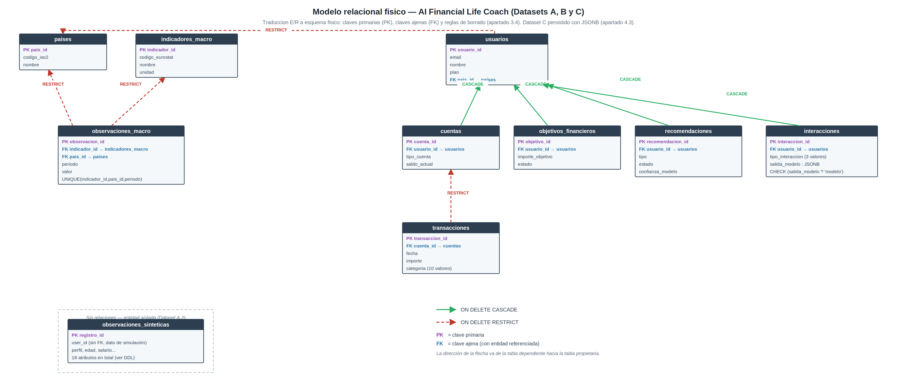

# Modelo de datos — AI Financial Life Coach (Grupo 05)

Este documento resume el modelo conceptual y físico implementado en este
repositorio, de forma autocontenida (sin necesidad de consultar el PDF
entregado para poder reproducir o auditar el esquema).

## 1. Diagrama Entidad-Relación (Datasets A, B y C — PostgreSQL)

## 2. Diagrama relacional físico (con claves ajenas y reglas de borrado)

## 3. Entidades y claves

Todas las entidades del modelo son **entidades fuertes**: cada una tiene una
clave primaria propia e independiente (identificador autoincremental). Cinco
de ellas mantienen además una **dependencia existencial** hacia otra entidad
(participación total, cardinalidad (1,1)):

| Entidad | Clave primaria | Depende existencialmente de | Regla de borrado |
|---|---|---|---|
| `paises` | `pais_id` | — | — |
| `indicadores_macro` | `indicador_id` | — | — |
| `observaciones_macro` | `observacion_id` | `indicadores_macro`, `paises` | RESTRICT |
| `observaciones_sinteticas` | `registro_id` | — (entidad aislada, Dataset A.2) | — |
| `usuarios` | `usuario_id` | `paises` (opcional) | RESTRICT |
| `cuentas` | `cuenta_id` | `usuarios` | CASCADE |
| `transacciones` | `transaccion_id` | `cuentas` | RESTRICT |
| `objetivos_financieros` | `objetivo_id` | `usuarios` | CASCADE |
| `recomendaciones` | `recomendacion_id` | `usuarios` | CASCADE |
| `interacciones` | `interaccion_id` | `usuarios` | CASCADE |

`observaciones_macro` resuelve además la única relación N:M del modelo
(`paises` ↔ `indicadores_macro`), incorporando los atributos propios de esa
relación (`periodo`, `valor`, `fuente`, `fecha_extraccion`) y una restricción
`UNIQUE (indicador_id, pais_id, periodo)` que evita duplicados temporales.

## 4. Reglas de integridad principales

- **CASCADE** se aplica cuando la entidad dependiente pierde todo su sentido
  sin la entidad propietaria (p. ej., las cuentas de un usuario eliminado, o
  su historial de interacciones con el asistente).
- **RESTRICT** se aplica cuando existe un requisito de conservación de
  historial que prevalece sobre la simplicidad del borrado (p. ej., las
  transacciones no pueden desaparecer arrastradas por el borrado de una
  cuenta sin una decisión explícita, por su valor de auditoría).
- El dominio de `transacciones.categoria` consta de diez valores cerrados:
  los siete alineados con las categorías de gasto del dataset sintético
  (`vivienda`, `alimentacion`, `transporte`, `ocio`, `salud`, `educacion`,
  `otros`) más tres adicionales propios de un libro de movimientos real que
  no existen en el dataset sintético por no ser gasto (`ingresos`, `ahorro`,
  `transferencia`).
- `observaciones_sinteticas` reproduce mediante restricciones `CHECK` las
  verificaciones de coherencia interna que ya validamos en la
  asignatura de obtención de datos: `gasto_total` como suma de las siete
  categorías, `ahorro = salario - gasto_total`, `tasa_ahorro_pct =
  ahorro / salario * 100`, y consistencia de `perfil_ahorro` respecto a los
  umbrales documentados. Los dominios y rangos de columna (`perfil` en
  `{junior, medio, senior, freelance}`, `edad` entre 25 y 40 años, `salario`
  entre 1.134 € y 6.800 €, y los rangos del resto de columnas numéricas) se
  han verificado y alineado con la tabla de variables del trabajo de la
  Asignatura 5 "Obtención de Datos para el TFM", para evitar cualquier
  divergencia entre nuestros propios entregables.
- `interacciones.salida_modelo` es de tipo `JSONB`, con una restricción
  `CHECK (salida_modelo ? 'modelo')` que garantiza que todo documento
  declare qué modelo lo generó, sin imponer una estructura fija al resto del
  contenido (que varía según el modelo de ML, ver apartado 6).

El detalle completo (tipos de datos, todas las restricciones, índices y la
vista `v_saldo_usuario`) está en [`../sql/ddl/001_schema.sql`](../sql/ddl/001_schema.sql).

## 5. Dataset C — interacciones con el asistente (JSONB sobre PostgreSQL)

El Dataset C se modela conceptualmente mediante un esquema de documento (JSON
anotado), no mediante un desglose exhaustivo en E/R, por la naturaleza
variable de su estructura según el modelo de machine learning que genera
cada interacción: forzar un E/R clásico exigiría una entidad con decenas de
atributos mayoritariamente nulos, o una jerarquía de subentidades a rediseñar
con cada nuevo modelo (apartado 3.1 del documento entregado).

**Persistimos `interacciones` en el mismo motor PostgreSQL** que el resto
del modelo, usando una columna `JSONB` para la parte de estructura variable
(`salida_modelo`) y columnas normales para los campos comunes a toda
interacción (`usuario_id`, `tipo_interaccion`, `timestamp`,
`entrada_usuario`, `respuesta_mostrada`). Los tres documentos de ejemplo (uno
por cada modelo de ML del TFM: regresión lineal, regresión logística, serie
temporal) están cargados en [`../sql/seed/002_seed.sql`](../sql/seed/002_seed.sql)
y son consultables con `Consulta 7` en
[`../sql/queries/consultas_representativas.sql`](../sql/queries/consultas_representativas.sql).

## 6. Justificación tecnológica (resumen)

| Dataset | Tecnología | Motivo principal |
|---|---|---|
| A.1, A.2, B, C | PostgreSQL 16 (columna `JSONB` para C) | Tipado numérico estricto, integridad referencial declarativa siempre activa, ACID completo, y una única tecnología que reduce la complejidad operativa del MVP frente a mantener dos motores de persistencia distintos |

El razonamiento comparativo completo (PostgreSQL vs. MySQL/MariaDB vs.
SQLite para A/B; MongoDB vs. PostgreSQL+JSONB para C, con la decisión final
revisada a favor de JSONB) está desarrollado en el documento PDF entregado,
apartados 4.2 y 4.3.

## 7. Evolución futura y arquitectura de producción

La arquitectura de producción prevista (Google Cloud Platform, integración
regulada con Tink como agregador PSD2, uso de Gemini para clasificación NLP
de transacciones) está documentada como referencia, sin implementar, en
[`alineacion_jira_asignatura3.md`](./alineacion_jira_asignatura3.md) y
[`tink_mapping.md`](./tink_mapping.md). Ninguna de las dos introduce una
dependencia externa en este MVP, que permanece ejecutable íntegramente en
local con `docker compose up -d`.

## 8. Fuentes

- Grupo 05 (C. Solis Meza, J. Cáceres Mondragón, M. Merola, M. Á. Lozano
  Torres). Fuentes y Obtención de Datos — Asignatura 5, Máster en Big Data &
  Business Intelligence, Next Educación. Trabajo académico del grupo.
  Repositorio: https://github.com/mmerola99/TFM---Grupo_05
- Grupo 05 (C. Solis Meza, J. Cáceres Mondragón, M. Merola, M. Á. Lozano
  Torres, C. A. Cuaya Xinto). Backlog ágil y metodología Scrum — Asignatura
  3, Máster en Big Data & Business Intelligence, Next Educación. Trabajo
  académico del grupo.
- Nuestro repositorio técnico:
  https://github.com/mmerola99/TFM---Grupo_05/tree/main/sgbd
